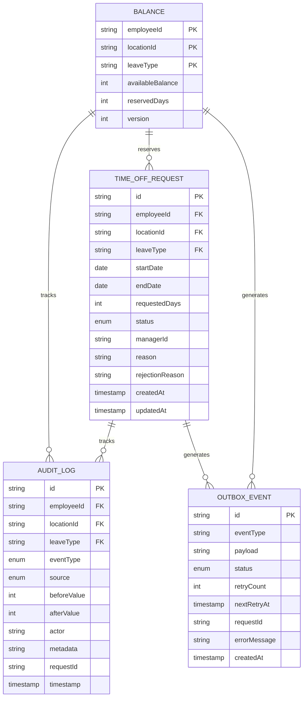

# LeaveBridge - Time-Off Microservice Technical Requirements Document

## Problem Statement

LeaveBridge is a production-quality backend microservice designed to manage the full lifecycle of employee time-off requests while maintaining synchronized leave balances with an external Human Capital Management (HCM) system. The system must handle concurrent requests, ensure data consistency, provide comprehensive audit trails, and gracefully handle HCM system failures.

## Constraints and Requirements

### Functional Requirements
- **Request Management**: Create, approve, cancel, and track time-off requests
- **Balance Management**: Maintain accurate leave balances with reservation system
- **HCM Integration**: Synchronize with external HCM system via real-time API, batch imports, and webhooks
- **Audit Trail**: Complete audit logging for all balance mutations and request state changes
- **Concurrency Control**: Handle simultaneous requests without data corruption
- **Failure Recovery**: Retry mechanisms for HCM communication failures

### Non-Functional Requirements
- **Performance**: Support high concurrency with optimistic locking
- **Reliability**: Transactional outbox pattern for HCM communication
- **Scalability**: Stateless design suitable for horizontal scaling
- **Testability**: ≥80% code coverage with comprehensive test suite
- **Maintainability**: Clean architecture with separation of concerns

## Proposed Solution

### Architecture Overview

LeaveBridge follows a layered architecture with clear separation of concerns:

```
┌─────────────────┐
│   Controllers   │ ← REST API endpoints
├─────────────────┤
│    Services     │ ← Business logic layer
├─────────────────┤
│   Data Access   │ ← TypeORM entities
├─────────────────┤
│   Database      │ ← SQLite (development) / PostgreSQL (production)
└─────────────────┘
```

### Data Model

#### Entity Relationship Diagram (ERD)



#### Key Entities

**Balance**
- Compound key: (employeeId, locationId, leaveType)
- Tracks available balance and reserved days
- Optimistic locking via version column

**TimeOffRequest**
- Manages request lifecycle: PENDING → APPROVED/CANCELLED/REJECTED
- Stores request details and approval metadata

**AuditLog**
- Immutable audit trail for all balance mutations
- Categorized by event type and source system

**OutboxEvent**
- Transactional outbox for reliable HCM communication
- Retry mechanism with exponential backoff

### API Contract (OpenAPI Style)

#### Time-Off Management

```yaml
/api/time-off/requests:
  post:
    summary: Create time-off request
    requestBody:
      required: true
      content:
        application/json:
          schema:
            type: object
            properties:
              employeeId: {type: string}
              locationId: {type: string}
              leaveType: {type: string, enum: [ANNUAL, SICK, UNPAID]}
              startDate: {type: string, format: date}
              endDate: {type: string, format: date}
              reason: {type: string}
    responses:
      201:
        description: Request created successfully
        content:
          application/json:
            schema:
              $ref: '#/components/schemas/TimeOffRequest'

  /{id}:
    get:
      summary: Get time-off request by ID
      parameters:
        - name: id
          in: path
          required: true
          schema: {type: string}
      responses:
        200:
          description: Request details
          content:
            application/json:
              schema:
                $ref: '#/components/schemas/TimeOffRequest'

  /{id}/approve:
    patch:
      summary: Approve time-off request
      parameters:
        - name: id
          in: path
          required: true
          schema: {type: string}
      requestBody:
        required: true
        content:
          application/json:
            schema:
              type: object
              properties:
                managerId: {type: string}
      responses:
        200:
          description: Request approved
        202:
          description: Request approved, pending HCM sync
        400:
          description: HCM rejection or validation error

  /{id}/cancel:
    patch:
      summary: Cancel time-off request
      parameters:
        - name: id
          in: path
          required: true
          schema: {type: string}
      requestBody:
        required: true
        content:
          application/json:
            schema:
              type: object
              properties:
                actorId: {type: string}
      responses:
        200:
          description: Request cancelled
```

#### Balance Management

```yaml
/api/balances/{employeeId}/{locationId}:
  get:
    summary: Get employee leave balances
    parameters:
      - name: employeeId
        in: path
        required: true
        schema: {type: string}
      - name: locationId
        in: path
        required: true
        schema: {type: string}
    responses:
      200:
        description: Balance information
        content:
          application/json:
            schema:
              type: object
              properties:
                employeeId: {type: string}
                locationId: {type: string}
                balances:
                  type: array
                  items:
                    type: object
                    properties:
                      leaveType: {type: string}
                      availableBalance: {type: integer}
                      reservedDays: {type: integer}
                      netAvailable: {type: integer}
```

#### Synchronization

```yaml
/api/sync/batch:
  post:
    summary: Process batch HCM synchronization
    requestBody:
      required: true
      content:
        application/json:
          schema:
            type: object
            properties:
              balances:
                type: array
                items:
                  type: object
                  properties:
                    employeeId: {type: string}
                    locationId: {type: string}
                    leaveType: {type: string}
                    balance: {type: integer}
    responses:
      200:
        description: Batch processed successfully
      409:
        description: Batch already processed (idempotency)

/api/sync/webhook:
  post:
    summary: Process HCM webhook event
    requestBody:
      required: true
      content:
        application/json:
          schema:
            type: object
            properties:
              employeeId: {type: string}
              locationId: {type: string}
              leaveType: {type: string}
              delta: {type: integer}
              reason: {type: string}
    responses:
      200:
        description: Webhook processed successfully

/api/audit/{employeeId}:
  get:
    summary: Get employee audit trail
    parameters:
      - name: employeeId
        in: path
        required: true
        schema: {type: string}
    responses:
      200:
        description: Audit trail
        content:
          application/json:
            schema:
              type: object
              properties:
                employeeId: {type: string}
                auditLogs:
                  type: array
                  items:
                    $ref: '#/components/schemas/AuditLog'
```

## Sync Strategy

### Real-Time Synchronization
- **Request Approval**: Immediate HCM API call during approval
- **Balance Updates**: HCM consulted for real-time balance verification
- **Failure Handling**: Outbox events for retry mechanism

### Batch Synchronization
- **Initial Load**: Full balance corpus import from HCM
- **Periodic Sync**: Scheduled batch updates for reconciliation
- **Idempotency**: SHA256 hash-based duplicate detection

### Webhook Integration
- **Real-Time Updates**: HCM pushes balance changes immediately
- **Delta Application**: Incremental balance adjustments
- **Floor Logic**: Prevent negative net-available balances

## Concurrency Approach

### Optimistic Locking
- **Version Column**: Each Balance entity includes version for optimistic locking
- **Transaction Boundaries**: All balance modifications within database transactions
- **Conflict Resolution**: Concurrent requests fail gracefully with clear error messages

### Reservation System
- **Pre-Approval Reservations**: Days reserved on request creation
- **Double-Spend Prevention**: Available balance = total - reserved
- **Automatic Cleanup**: Reservations released on approval/cancellation

### Race Condition Handling
```typescript
// Example concurrent request handling
async reserveDays(employeeId, locationId, leaveType, days) {
  return await this.dataSource.transaction(async manager => {
    const balance = await manager.findOne(Balance, {
      where: { employeeId, locationId, leaveType },
      lock: { mode: 'pessimistic_write' }
    });
    
    const available = balance.availableBalance - balance.reservedDays;
    if (available < days) {
      throw new Error('Insufficient balance');
    }
    
    balance.reservedDays += days;
    await manager.save(balance);
  });
}
```

## Idempotency Design

### Transactional Outbox Pattern
- **Atomic Operations**: Balance changes and outbox events in same transaction
- **Retry Mechanism**: Failed HCM calls stored for retry with exponential backoff
- **Event Ordering**: Sequential processing to maintain consistency

### Batch Sync Idempotency
- **Content Hashing**: SHA256 hash of entire batch payload
- **Duplicate Detection**: Metadata table tracks processed batches
- **Safe Retries**: Multiple identical batch calls have no side effects

### Request Idempotency
- **Request IDs**: UUID generation for unique request identification
- **State Validation**: Prevent duplicate state transitions
- **Audit Correlation**: All events linked to original request ID

## Failure Modes and Mitigations

### HCM Communication Failures

#### Network Issues
- **Detection**: Connection timeouts, HTTP errors
- **Mitigation**: Outbox events with retry mechanism
- **Recovery**: Background retry with exponential backoff

#### HCM Rejection
- **Detection**: HTTP 400 with error codes
- **Mitigation**: Request rejection, reservation cleanup
- **User Experience**: Clear error messages with HCM details

#### HCM Unavailability
- **Detection**: Connection refused, timeouts
- **Mitigation**: 202 response with retry-after header
- **Recovery**: Automatic retry when HCM returns online

### Database Failures

#### Constraint Violations
- **Detection**: Unique constraint failures
- **Mitigation**: Optimistic locking with retry
- **Recovery**: Client-side retry with backoff

#### Transaction Rollbacks
- **Detection**: Deadlocks, constraint violations
- **Mitigation**: Automatic transaction retry
- **Recovery**: Consistent state restoration

### Consistency Issues

#### Balance Drift
- **Detection**: Periodic reconciliation with HCM
- **Mitigation**: Audit trail analysis
- **Recovery**: Manual adjustment with audit record

#### Orphaned Reservations
- **Detection**: Stale PENDING requests
- **Mitigation**: Automatic cleanup job
- **Recovery**: Reservation release with audit log

## Alternatives Considered

### Pessimistic Locking
**Pros**: Guaranteed consistency, simple implementation
**Cons**: Performance bottlenecks, deadlock potential
**Rejected**: Optimistic locking provides better performance with acceptable complexity

### Event Sourcing
**Pros**: Complete audit trail, temporal queries
**Cons**: Complexity, storage overhead, learning curve
**Rejected**: Traditional audit logging provides sufficient traceability

### HCM as Single Source of Truth
**Pros**: No local state, always current
**Cons**: Performance impact, single point of failure
**Rejected**: Local caching provides resilience and performance

### Distributed Transactions
**Pros**: Atomic cross-system operations
**Cons**: Complexity, performance impact, vendor lock-in
**Rejected**: Outbox pattern provides similar benefits with better reliability

## Known Limitations

### Performance Constraints
- **Database Contention**: High concurrency on same employee balances
- **HCM Latency**: External API calls add request processing time
- **Memory Usage**: In-memory SQLite for development (PostgreSQL for production)

### Functional Limitations
- **Complex Rules**: No support for complex leave policies (carryover, accruals)
- **Multi-Tenant**: Single tenant design (requires extension for multi-tenant)
- **Time Zones**: Date handling assumes consistent timezone

### Operational Limitations
- **Manual Recovery**: Some failure scenarios require manual intervention
- **Monitoring**: Limited built-in monitoring (requires external observability)
- **Scaling**: Horizontal scaling requires shared database state

## Technology Stack

### Backend Framework
- **NestJS**: Node.js framework with dependency injection
- **TypeScript**: Type safety and enhanced developer experience
- **TypeORM**: Database ORM with transaction support

### Database
- **SQLite**: Development and testing (in-memory)
- **PostgreSQL**: Production deployment (recommended)

### Testing
- **Jest**: Unit and integration testing framework
- **Supertest**: HTTP endpoint testing
- **@faker-js/faker**: Test data generation

### Communication
- **Axios**: HTTP client for HCM communication
- **Express**: HTTP server framework
- **Class-validator**: Input validation

## Deployment Considerations

### Environment Configuration
- **Database**: Configurable connection strings
- **HCM**: Base URL and timeout settings
- **Logging**: Configurable log levels and destinations

### Monitoring
- **Health Checks**: Application and dependency health
- **Metrics**: Request latency, error rates, queue depth
- **Alerting**: Failure rate thresholds and system availability

### Scaling
- **Horizontal**: Multiple instances behind load balancer
- **Database**: Connection pooling and read replicas
- **HCM**: Circuit breaker pattern for external dependencies

## Security Considerations

### Authentication
- **JWT Tokens**: Request authentication and authorization
- **Role-Based Access**: Manager vs employee permissions
- **API Keys**: HCM system authentication

### Data Protection
- **PII Handling**: Employee data protection requirements
- **Audit Privacy**: Sensitive audit log protection
- **Encryption**: Data in transit and at rest

### Input Validation
- **Schema Validation**: Request body validation
- **SQL Injection**: ORM parameterized queries
- **XSS Protection**: Input sanitization and output encoding

## Conclusion

LeaveBridge provides a robust, scalable solution for time-off management with comprehensive audit trails, reliable HCM integration, and strong consistency guarantees. The architecture balances performance, reliability, and maintainability while addressing the complex requirements of enterprise leave management systems.

The combination of optimistic locking, transactional outbox patterns, and comprehensive testing ensures the system can handle real-world production workloads while maintaining data integrity and providing excellent user experience.
